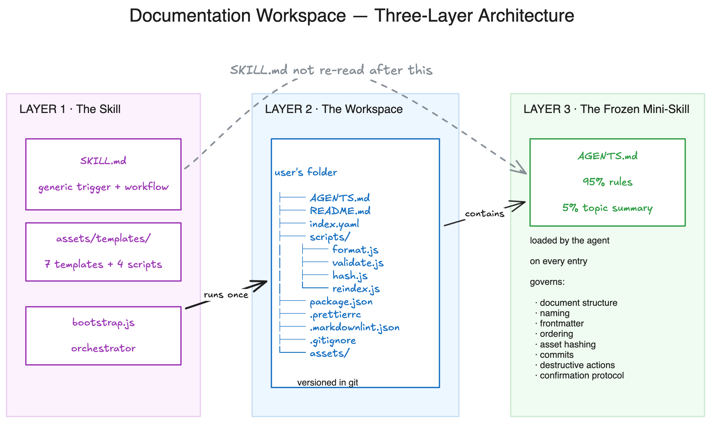
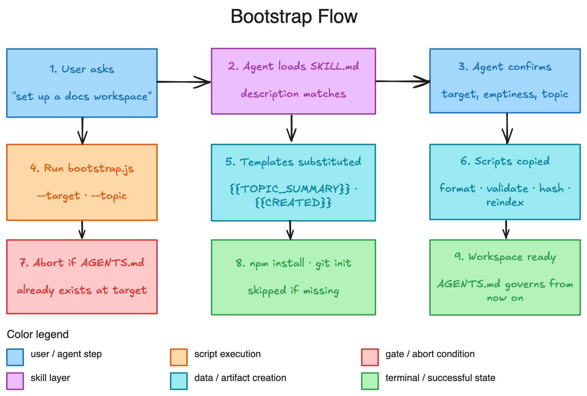

# documentation-workspace

> An agent-agnostic skill that bootstraps a versioned, file-system-based documentation workspace into any empty (or near-empty) directory. The result is a self-contained knowledge base with its own `AGENTS.md` — a per-workspace, topic-specific "frozen mini-skill" the agent reads on every entry.

## What this is

This repository is the **source** of the `documentation-workspace` skill. The artifact an agent runtime actually consumes is [`SKILL.md`](SKILL.md) — the file the skill loader reads when a user triggers the skill. Everything else in this repo supports the skill: templates it instantiates, scripts it runs, references it may load.

The skill format (a `SKILL.md` with frontmatter `name` and `description`, plus an `assets/` directory) follows a common convention shared by several agent runtimes (e.g. Kilo, Claude Code, OpenCode, Cursor). The skill itself is agent-agnostic — any runtime that supports this convention can load and run it.

> **Note:** `SKILL.md` lives at the repo root (not in a `skill/` subdirectory) because some skill loaders and registries — Smithery, for one — expect it at the root. Don't move it back.

## The three-layer architecture

The system has three distinct layers, each with a single responsibility:



| Layer | Lives in | Purpose |
|---|---|---|
| 1. **The skill** | this repo (root) | Generic, agent-agnostic trigger + bootstrap workflow. The agent reads this once, when the user asks to bootstrap. |
| 2. **The workspace** | the user's target folder | The actual project. Versioned in Git, free, local-first, no vendor lock-in. |
| 3. **The frozen mini-skill** | `<workspace>/AGENTS.md` | Per-workspace, **95% rules + 5% topic summary**. The agent reads this — not Layer 1 — while working inside the workspace. |

The dashed arrow above matters: once Layer 3 exists, Layer 1 is no longer in the loop. The skill only runs at the moment of bootstrap.

## Repo layout

```text
documentation-workspace/
├── SKILL.md                            ← the skill (consumed by an agent runtime)
├── AGENTS.md                           ← repo-level rules (for contributors)
├── README.md                           ← you are here
├── .gitignore
├── docs/                               ← README diagrams
│   ├── architecture.png
│   └── bootstrap-flow.png
├── assets/                             ← the skill's bundled assets
│   ├── templates/                      ← instantiated into the target workspace
│   │   ├── AGENTS.md.template          ← the frozen mini-skill template
│   │   ├── README.md.template
│   │   ├── index.yaml.template
│   │   ├── package.json.template
│   │   ├── _gitignore_.template
│   │   ├── _prettierrc_.template
│   │   └── _markdownlint.json_.template
│   ├── workspace-scripts/              ← copied verbatim into target/scripts/
│   │   ├── format.js                   ← Prettier
│   │   ├── validate.js                 ← markdownlint
│   │   ├── hash.js                     ← SHA-256 + manifest
│   │   └── reindex.js                  ← regenerate README auto-index
│   └── skill-scripts/
│       └── bootstrap.js                ← orchestrator (lives in the skill, not in target)
└── references/                         ← loaded only when relevant
    ├── asset-management.md
    └── document-promotion.md
```

The underscore-wrapped template filenames (`_foo_.template`) are an **explicit, load-bearing convention**: a hard-coded `TEMPLATE_NAME_MAPPING` table in `bootstrap.js` maps each one to its dotfile name (`.foo`). Do not "fix" the underscore by renaming the file — see [Bugs caught during development](#bugs-caught-during-development) below.

## How to install

Copy or symlink this repo into a location your agent runtime scans for skills. Common paths:

| Runtime | Path |
|---|---|
| Kilo (user-global) | `~/.kilo/skills/documentation-workspace/` |
| Kilo (project-local) | `<project>/.kilo/skills/documentation-workspace/` |
| Claude Code (user-global) | `~/.claude/skills/documentation-workspace/` |
| OpenCode | follow that runtime's skill discovery convention |

The folder name **must be** `documentation-workspace` — that is the skill's `name` and how the loader matches it.

```sh
git clone https://github.com/SBTopZZZ-LG/documentation-workspace-skill.git \
  ~/.agent/skills/documentation-workspace
```

After install, the skill triggers on phrases like *"set up a docs workspace"*, *"scaffold a docs folder"*, *"organize my notes into folders"*, etc. (see `SKILL.md` for the full description).

## How to use (as a user)

Say any of the trigger phrases to your agent. The agent will:

1. Confirm the target directory.
2. Confirm the target is empty (or get explicit opt-in).
3. Ask for a 1–2 paragraph topic summary.
4. Run `bootstrap.js`, which copies templates, instantiates the workspace, and runs `npm install` + `git init` (if available).
5. Hand the workspace over to its own `AGENTS.md`.

## How to develop (the smoke test)

There is no build, no test framework, no linter, no CI at this repo. The only executable verification is end-to-end:

```sh
rm -rf /tmp/agent-docs-test
mkdir -p /tmp/agent-docs-test
node assets/skill-scripts/bootstrap.js \
  --target /tmp/agent-docs-test \
  --topic "Smoke test workspace."
cd /tmp/agent-docs-test && npm run validate
```

This exercises template substitution, script copying, `npm install`, `git init`, and the lint/format pipeline. Inspect the result and clean up.

For day-to-day iteration, edit the appropriate file and re-run the smoke test:

| Changing… | Edit |
|---|---|
| The skill's behavior or trigger description | `SKILL.md` |
| The per-workspace rules | `assets/templates/AGENTS.md.template` |
| Workspace-shipped scripts | `assets/workspace-scripts/*.js` |
| The bootstrap orchestrator | `assets/skill-scripts/bootstrap.js` |
| Optional reference docs | `references/*.md` |
| This file | `README.md` |
| Repo-level agent rules | `AGENTS.md` |

## Bootstrap flow

What actually happens when the skill runs:



Key gates the agent enforces:

- **Refuses** to bootstrap into a directory that already has an `AGENTS.md` (workspace is already bootstrapped — follow the existing one).
- **Refuses** a non-empty target unless the user gives strict positive affirmation.
- **Skips** `npm install` if Node/npm is missing (warns). **Skips** `git init` if git is missing (warns). Does not refuse.

## Opinionated defaults baked into the AGENTS.md template

These are decisions you may not realize you have, because they are pre-decided for you:

- **Format**: Markdown (default); HTML/JSON/YAML where structure matters; binaries in `assets/`.
- **Layout**: GitHub-style — doc with sub-docs is a folder named after the doc, with `README.md` inside. Leaf doc is a single `.md` file. Recursive.
- **Naming**: kebab-case, lowercase, ASCII.
- **Frontmatter** (mandatory for `.md`/`.html`/`.yaml`/`.txt`): `title`, `summary` (exactly one sentence), `status` (draft | stable | deprecated), `created` (YYYY-MM-DD). No `tags` — use `index.yaml`. No `updated` — derive from mtime or git.
- **Document ordering**: per-directory `index.yaml` with `documents: - path / title / summary`. Empty list = no order prescribed.
- **Asset management**: content-addressed (SHA-256, truncated to 12 hex chars), per-doc `<doc>/assets/` for local, `<workspace>/assets/` for shared, `manifest.yaml` maps logical name → hash-filename.
- **Editing**: always read first; partial edits preferred; full rewrites require a `<filename>.<ext>.bak` (never committed, local only).
- **Destructive actions** require strict positive confirmation: delete, move, section removal, `status: deprecated`, single-file → folder promotion. Renames and partial content replacements do not.
- **Commits**: Conventional Commits, lowercase imperative subject ≤ 50 chars, agent-driven commits add `Co-authored-by: AI Agent <agent@local>`.
- **Tooling**: Prettier (120-char, proseWrap preserve) + markdownlint-cli + js-yaml. Lint/format is the only quality gate.

If you want any of these changed, edit `assets/templates/AGENTS.md.template` — **not** `SKILL.md` and **not** a one-off example.

## Bugs caught during development

These were real, not theoretical — keep them in mind before "fixing" the code:

1. **Dot-file convention was broken for multi-segment names.** `_markdownlint.json.template` rendered as `_markdownlint.json` instead of `.markdownlint.json`. Fixed by replacing the underscore-wrap heuristic with an explicit `TEMPLATE_NAME_MAPPING` table in `bootstrap.js`. Renamed the file to `_markdownlint.json_.template`. **Do not rename the templates to drop the trailing underscore.**
2. **`---` code-block delimiters in `AGENTS.md.template` were interpreted as horizontal rules** by markdown renderers. Replaced with proper fenced code blocks (with language tags). The rule "no triple ticks in `SKILL.md`" is specific to that file — do not generalize it to other Markdown.
3. **markdownlint MD025 false positive** on the workspace's `README.md`: it read the `title:` frontmatter field as a top-level heading. Fixed by adding `"MD025": { "front_matter_title": "" }` to `.markdownlint.json`.
4. **Skill hidden inside `skill/` subdirectory** broke registration with some loaders (Smithery requires `SKILL.md` at the repo root). Fixed by moving `SKILL.md` and `assets/` and `references/` to root.

## What's NOT in scope

These were explicitly deferred:

- **Notion-like UI server** — a local server hosting the workspace with a beautiful UI. Could be a separate skill.
- **More helper scripts** — e.g. `link-check.js`, `toc-generator.js`, `frontmatter-lint.js`.
- **Tag system** — the user removed `tags` from frontmatter (use `index.yaml` instead). If a tagging system is wanted later, could be a separate file.
- **Description optimization for triggering accuracy** — the `skill-creator` skill has a separate description-improver loop. Not run.
- **Packaging as `.skill` file** — `skill-creator` has a `package_skill.py`. Not run.

## Cross-references

- `AGENTS.md` — repo-level agent instructions (this repo's own development rules).
- `SKILL.md` — the skill the agent reads when triggered.
- `assets/templates/AGENTS.md.template` — the heart of the system; most iteration will happen here.
- `references/asset-management.md` — content-addressed asset workflow.
- `references/document-promotion.md` — promoting a single-file doc to a folder.
- `~/documentation-workspace-meta.md` — design rationale, conversation arc, and session-handoff notes.
